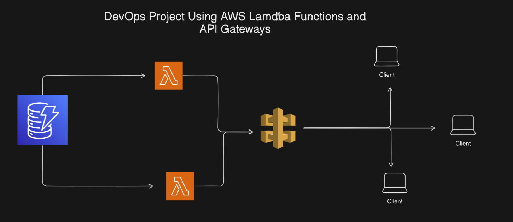

# CRUD API with AWS Lambda and DynamoDB

This project provides a complete CRUD (Create, Read, Update, Delete) API using AWS Lambda with Node.js and DynamoDB as the database. The API can be connected to an API Gateway for interacting with the API via HTTP methods.

## Features

- **Create**: Add a new item to the DynamoDB table.
- **Read**: Retrieve an item by its ID.
- **Update**: Modify the details of an existing item.
- **Delete**: Remove an item by its ID.
- **DynamoDB**: The project uses Amazon DynamoDB for storing items with a simple schema.

## Tech Stack

- **Node.js** (AWS Lambda)
- **AWS DynamoDB** (NoSQL Database)
- **API Gateway** (for exposing Lambda functions over HTTP)
- **AWS IAM** (for permissions)

## Prerequisites

- AWS account with necessary permissions to use Lambda and DynamoDB.
- Node.js installed (for local testing or running scripts).
- AWS CLI (optional for deploying).

 

  

## How to Star the Repository
If you find this project helpful, please star the repository on GitHub to show your support:
1. Click the ⭐ button in the top-right corner.

---

## Author
**Jibran**  
Passionate DevOps Engineer and Software Developer.
Connect with me on [LinkedIn](https://www.linkedin.com/in/muhammad-jibran220/).

---
 

## Feedback & Contributions
Contributions are welcome! Feel free to fork the repository and submit a pull request.

---

 